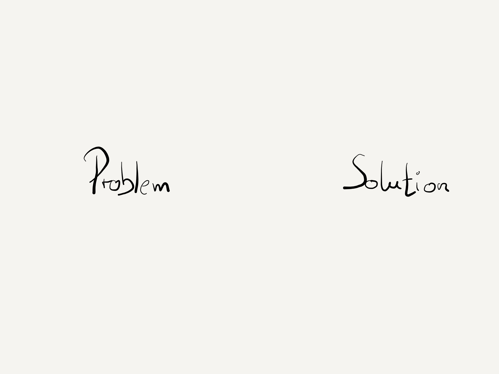
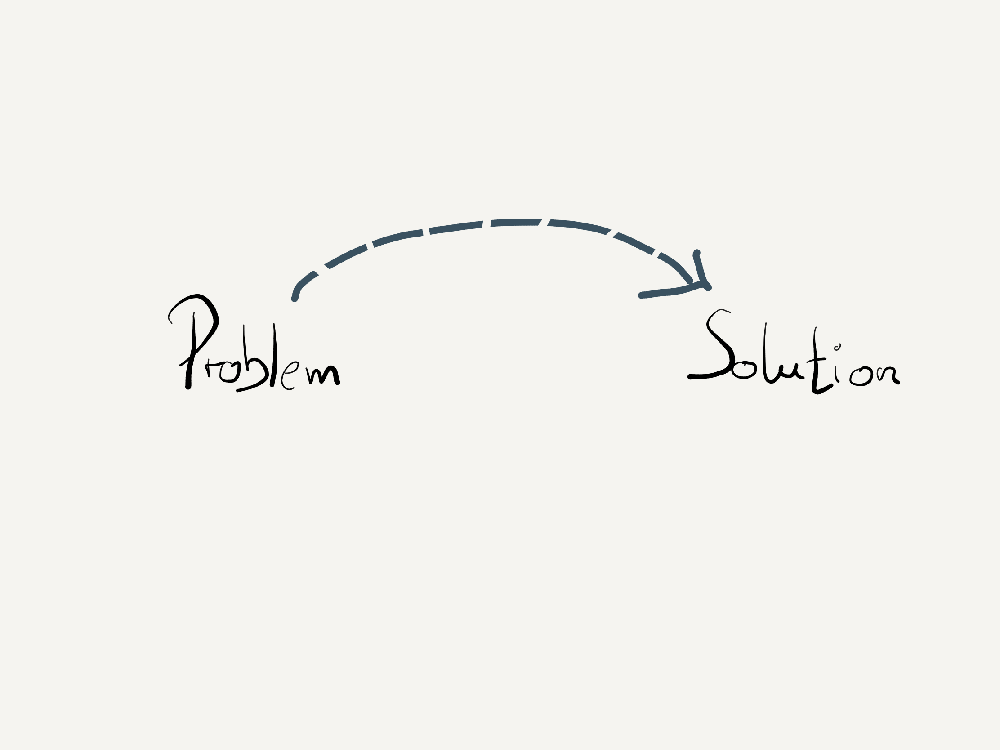

# Demonstration Of Question First Approach

Question first is something like Test First Approach.

This sample project uses Kent Beck's Money Kata for demonstrating the differences.

### From Problem to Solution

In the beginning there is always a problem to be solved. Solved by a software solution.

So, software developer are doing this.

We find a solution for a problem. 

